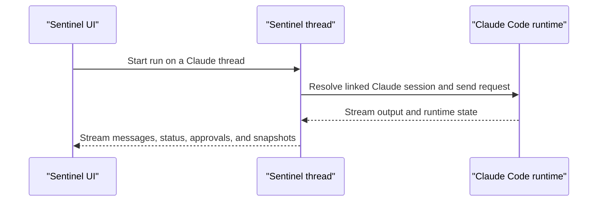

Sentinel can also use the local Claude Code runtime inside the same shell.

The model runtime changes, but the thread model and app shell stay where they are.

## What Sentinel keeps for a Claude thread

A Claude-backed thread can carry:

- Claude session ID
- permission mode
- working directory
- model

That is enough for Sentinel to reopen the thread and keep the runtime connection lined up with the rest of the thread state.

The split is close to Codex, but a little simpler.

Sentinel keeps the durable thread record. Claude Code keeps the active local session.

## Permission mode

Claude has its own permission-mode surface inside the thread state.

That permission mode lives alongside the rest of the thread runtime state, so the app can keep it attached to the thread instead of treating it as a temporary session flag.

That permission mode affects how the runtime can act during a run, especially when the thread is touching the local machine.

## Model handling

Sentinel asks the local Claude setup for runtime status and available models.

If the local runtime responds normally, the app uses those runtime models directly.

If the binary is present but the model discovery call times out, Sentinel can still surface fallback model entries so the thread UI does not stall out.

That fallback matters for the same reason it matters on Codex: local runtime checks can be a little uneven.

So here too, the app is trying to keep the thread stable even when runtime discovery is slower than the main UI expects.

## Run shape

Claude Code sits in roughly the same product position as Codex:

The main difference is the runtime state surface. The outer product shape stays the same.

The session record is smaller than the Codex one, but the pattern is the same:

1. Resolve the saved Claude-linked thread state.
2. Send the current turn into the Claude session.
3. Stream output and status back through the thread.
4. Persist the updated state in Sentinel around the runtime.

## What stays in Sentinel

Even when Claude Code is running the thread, Sentinel still owns:

- the thread list
- the workspace state
- the repo panels
- the shell
- settings

So the runtime changes, but the rest of the product stays steady.
