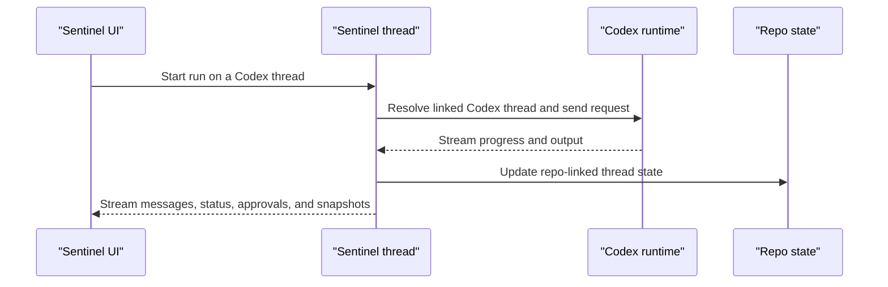

Sentinel can hand a thread off to the local Codex runtime and still keep the rest of the app around it.

That split matters.

Codex is driving the run. Sentinel is still carrying the thread, the workspace, the repo panels, the settings, and the rest of the shell.

## What Sentinel keeps for a Codex thread

| Field              | Why it matters                                          |
| ------------------ | ------------------------------------------------------- |
| Codex thread ID    | Maps the Sentinel thread back to the live Codex session |
| Approval policy    | Decides when the runtime has to stop and ask            |
| Sandbox mode       | Decides how much machine access the runtime gets        |
| Working directory  | Keeps the session attached to the right project path    |
| Model              | Keeps model selection stable across turns               |
| Reasoning effort   | Carries the thread's current reasoning level            |
| CLI version        | Helps explain runtime behavior across local installs    |
| Pending turn state | Lets Sentinel keep track of work still in flight        |

That state lives with the Sentinel thread, so the app can reopen the thread and still know how it was wired.

The important split is simple. Sentinel owns the durable thread record. Codex owns the active local runtime session.

## Codex policies

Codex has its own policy surface inside Sentinel.

Those policies shape how much freedom the Codex run gets when it is acting on the machine.

The sandbox modes and approval policies are stored as thread runtime state.

That matters because the policy has to survive past a single run. If a thread is reopened later, the app still needs to know how much access that thread was meant to have.

| Policy field    | Values in the runtime state                          |
| --------------- | ---------------------------------------------------- |
| Approval policy | `untrusted`, `on-failure`, `on-request`, `never`     |
| Sandbox mode    | `read-only`, `workspace-write`, `danger-full-access` |

## Model handling

Sentinel asks the local Codex setup for runtime status and available models.

If that status call comes back clean, the app uses the runtime models directly.

If the runtime is present but model discovery times out, Sentinel can still surface a small fallback list so the thread UI stays usable.

That fallback path matters because local runtime status is sometimes slower or rougher than the normal app flow.

So the model picker is doing two jobs at once. It shows what the local runtime actually reported, and it keeps the thread operable when runtime discovery is slow.

## Codex-specific thread actions

Codex has extra thread actions that do not apply to the other engines:

- review
- rollback
- compact
- fork
- archive
- unarchive

Those actions work by resolving the Sentinel thread back to the linked Codex thread ID first.

So even the Codex-specific actions still move through the Sentinel thread model.

That is why those actions show up as thread behavior in the product instead of looking like detached CLI controls.

## Run shape

This is the rough shape of a Codex-backed thread:



The important part is that the Codex runtime is sitting inside the Sentinel thread model.

In practical terms, the flow usually goes like this:

1. The thread resolves its saved Codex runtime state.
2. Sentinel passes the request into the Codex session.
3. Codex streams progress, tool activity, and output back through the thread.
4. Sentinel persists the updated thread and repo state around the run.

## Code shape

The Codex state surface is defined explicitly in the runtime types:

```ts
export const codexThreadStateSchema = z.object({
  approvalPolicy: codexApprovalPolicySchema.nullish(),
  cliVersion: z.string().nullish(),
  codexThreadId: z.string(),
  cwd: z.string().nullish(),
  modelId: z.string().nullish(),
  modelProvider: z.string().nullish(),
  pendingTurnId: z.string().nullish(),
  reasoningEffort: z.enum(REASONING_EFFORTS).nullish(),
  sandboxMode: codexSandboxModeSchema.nullish(),
});
```

The compact action is also exposed directly through the engine router:

```ts
codexCompact: protectedProcedure
  .input(z.object({ threadId: z.string() }))
  .mutation(async ({ ctx, input }) => {
    const codexThreadId = await resolveCodexThreadId(ctx, input.threadId);
    const codex = getCodexAppServerManager();
    return codex.compactThread(codexThreadId);
  }),
```

## What stays in Sentinel

Even when Codex is running the thread, Sentinel still owns:

Sentinel still owns workspace selection, thread history, repo panels, the terminal and browser shell, settings, and sidebar state. So the Codex runtime is deep in the loop, but it is still one layer inside a larger thread model.

## Code references

- [`types.ts`](https://github.com/Cronacl/Sentinel/blob/main/src/lib/ai/chat/engines/types.ts)
- [`engines.ts`](https://github.com/Cronacl/Sentinel/blob/main/src/server/api/routers/engines.ts)
