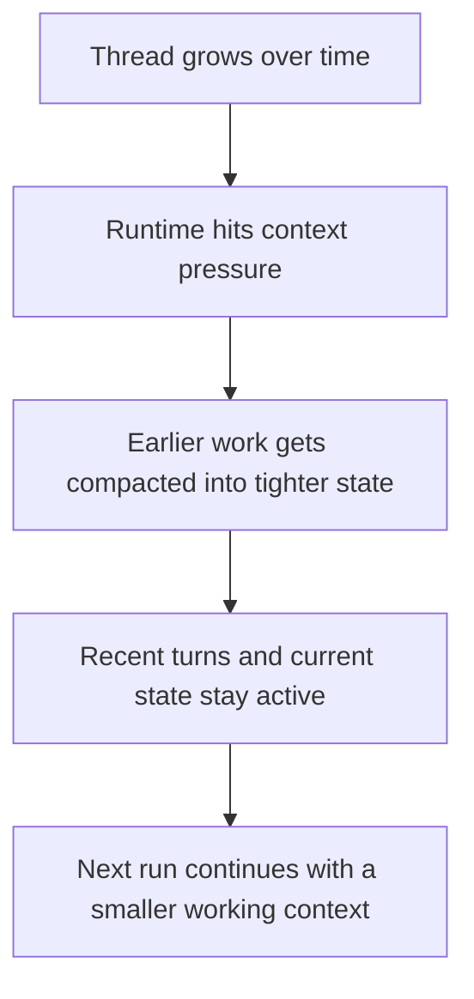

Context compaction is how a thread keeps moving once the working set gets too large to carry around cleanly.

This comes up in longer runs.

It also comes up when a thread has picked up a lot of tool output, repo state, streamed steps, and follow-up work.

## Why it exists

A long thread accumulates message history, tool output, plan state, repo-linked state, delegated work, and runtime session state. At some point, carrying every raw turn forward starts to hurt more than it helps.

The thread still needs continuity. It just does better with a tighter working context.

## What compaction is doing

Compaction reduces the amount of raw history that needs to stay in the active context window.

The thread keeps its identity and its stored history.

What changes is the live working context used for the next part of the run.

| Stays active                                                                                                | Gets compacted                                                                               |
| ----------------------------------------------------------------------------------------------------------- | -------------------------------------------------------------------------------------------- |
| Recent turns, current repo state, current workspace state, current plan state, current engine runtime state | Earlier raw turns, older tool output, older reasoning trace, older intermediate thread state |

So the thread stays continuous without dragging the full raw transcript through every step.

## What it does not change

Compaction is not the same as deleting thread history.

It is not a reset either.

The older work is still part of the thread record.

The change is in what gets treated as active working context during the next run.

## Where it shows up

You can feel compaction a few ways:

- a long thread keeps responding coherently instead of slowing down into noisy repetition
- the active run stays focused on the current branch of work
- old tool output stops crowding out the newer task state

## Runtime shape

At a high level, the flow looks like this:



## Sentinel and local runtimes

Compaction sits at the boundary between the thread model and the engine runtime.

Sentinel still owns the thread record around the run.

The active runtime cares about what stays in the live working context for the next turn.

That matters more on longer technical threads where the working set is changing while the user is still trying to stay on the same line of work.

There is also a real stored checkpoint for compaction on the thread. The schema keeps the summary text, the last message covered by that summary, and the time it was updated. The refresh path also protects against stale background writes when the thread has already moved on.

## Codex threads

On Codex-backed threads, compaction is also a real thread action.

That makes sense for the way Codex sessions can stretch across long coding tasks.

The important part is that the compacted state still stays attached to the same Sentinel thread.

The thread is still the durable unit. Compaction just changes the active load the runtime carries forward.

## Why it matters in Sentinel

Sentinel keeps more state around a thread than a basic chat app does.

That is useful, but it also means long-running threads can get heavy faster.

Compaction is one of the things that lets the app keep the richer thread model without letting the active runtime context sprawl forever.

## Code shape

The runtime keeps a separate refresh path for the compaction checkpoint:

```ts
const startingCheckpoint = await persist.getThreadContextCompactionCheckpoint(
  input.threadId,
);
const result = await applyContextCompaction({
  checkpoint: startingCheckpoint,
  transcript: input.transcript,
  windowPercent: input.windowPercent,
});
```

There is also a direct Codex thread action for compaction:

```ts
codexCompact: protectedProcedure
  .input(z.object({ threadId: z.string() }))
  .mutation(async ({ ctx, input }) => {
    const codexThreadId = await resolveCodexThreadId(ctx, input.threadId);
    const codex = getCodexAppServerManager();
    return codex.compactThread(codexThreadId);
  }),
```

One useful detail from the test coverage is that prompt assembly and context compaction can start in parallel during bootstrap. That keeps compaction from becoming a hard preflight bottleneck on every long thread.

## Code references

- [`context-compaction-refresh.ts`](https://github.com/Cronacl/Sentinel/blob/main/src/lib/ai/chat/runtime/context-compaction-refresh.ts)
- [`run-thread-chat.ts`](https://github.com/Cronacl/Sentinel/blob/main/src/lib/ai/chat/runtime/run-thread-chat.ts)
- [`schema.ts`](https://github.com/Cronacl/Sentinel/blob/main/src/server/db/schema.ts)
- [`engines.ts`](https://github.com/Cronacl/Sentinel/blob/main/src/server/api/routers/engines.ts)
