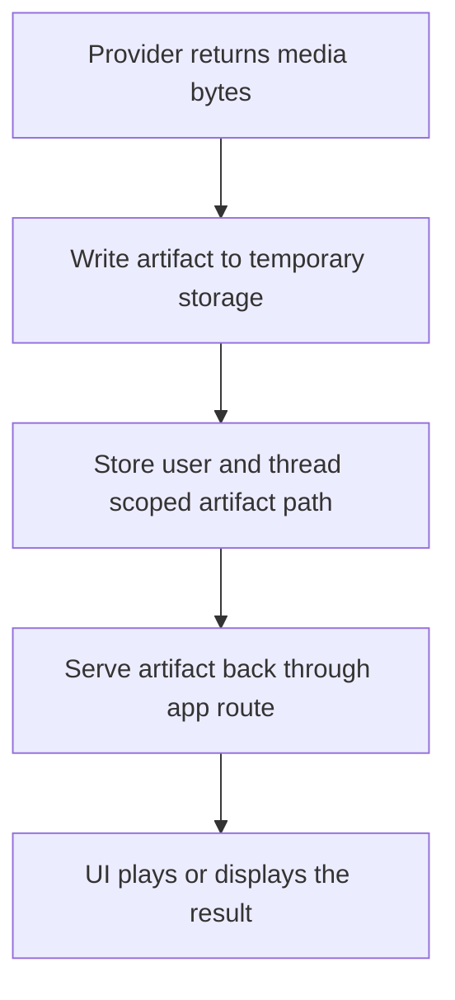

Sentinel treats image and video generation as separate runtime areas.

They have their own settings, their own provider state, and their own output handling.

## Image generation

Image generation has its own provider-level setup.

The app keeps track of:

- which providers are enabled for images
- which image model is selected for each provider
- which provider is the default

That keeps image generation separate from the normal chat model path.

That separation matters because image generation has a different request shape, a different result shape, and a different settings surface.

## Video generation

Video generation has its own provider-level setup too.

The runtime can fan out across more than one provider in a single run, within the limits the app sets for:

- number of targets
- outputs per target
- total outputs

That makes video generation more like a controlled batch path than a normal single-response tool.

The app is basically managing a bounded job fan-out there instead of a one-shot answer.

## Artifact handling

Generated media goes through temporary artifact storage first.

For video, the artifact flow is roughly:

Artifacts are scoped to the user and thread.

The storage is temporary and cleaned up on a TTL.

That makes generated media feel local and fairly disposable instead of becoming part of the permanent app database.

## Why this stays separate

Media generation sits near chat in the product, but operationally it is different:

- different providers
- different models
- different limits
- different artifact handling

Keeping it separate makes the runtime easier to reason about.
