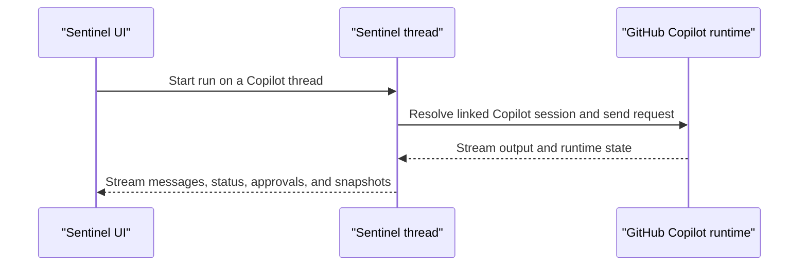

Sentinel can also use the local GitHub Copilot runtime inside the same shell.

The model runtime changes, but the thread model and app shell stay where they are.

## What Sentinel keeps for a Copilot thread

A Copilot-backed thread can carry:

- Copilot session ID
- working directory
- model
- reasoning effort

That is enough for Sentinel to reopen the thread and keep the runtime connection lined up with the rest of the thread state.

The split is close to Claude Code.

Sentinel keeps the durable thread record. GitHub Copilot keeps the active local session.

## Runtime status and auth

Copilot has its own runtime-status surface inside Sentinel.

That status layer is doing a little more than simple model discovery.

The app checks whether the Copilot CLI is present, whether auth is ready, and whether the runtime can return the current model list in time.

That matters because a local runtime can be installed but still not be ready to run a thread if auth is missing.

## Model handling

Sentinel asks the local Copilot setup for runtime status and available models.

If the local runtime responds normally, the app uses those runtime models directly.

If the CLI is present and authenticated but model discovery times out, Sentinel can still surface a small fallback model list so the thread UI does not stall out.

That fallback matters for the same reason it matters on Codex and Claude: local runtime checks can be a little uneven.

So here too, the app is trying to keep the thread stable even when runtime discovery is slower than the main UI expects.

## Run shape

GitHub Copilot sits in roughly the same product position as Claude and Codex:



The main difference is the runtime state surface. The outer product shape stays the same.

The session record is still smaller than the Codex one, but the pattern is familiar:

1. Resolve the saved Copilot-linked thread state.
2. Send the current turn into the Copilot session.
3. Stream output and status back through the thread.
4. Persist the updated state in Sentinel around the runtime.

## Code shape

The Copilot state surface is defined explicitly in the runtime types:

```ts
export const copilotThreadStateSchema = z.object({
  cwd: z.string().nullish(),
  modelId: z.string().nullish(),
  reasoningEffort: z.enum(REASONING_EFFORTS).nullish(),
  sessionId: z.string(),
});
```

The model router also gives Copilot the same fallback-model path as the other local runtimes:

```ts
if (input.engine === "copilot") {
  const status = await runtimeStatuses.copilot();
  const models = canUseCopilotFallbackModels(status)
    ? buildFallbackCopilotModels()
    : status.availableModels;
```

## What stays in Sentinel

Even when GitHub Copilot is running the thread, Sentinel still owns:

- the thread list
- the workspace state
- the repo panels
- the shell
- settings

So the runtime changes, but the rest of the product stays steady.

## Code references

- [`types.ts`](https://github.com/Cronacl/Sentinel/blob/main/src/lib/ai/chat/engines/types.ts)
- [`copilot-sdk.ts`](https://github.com/Cronacl/Sentinel/blob/main/src/lib/ai/chat/engines/copilot-sdk.ts)
- [`engines.ts`](https://github.com/Cronacl/Sentinel/blob/main/src/server/api/routers/engines.ts)
