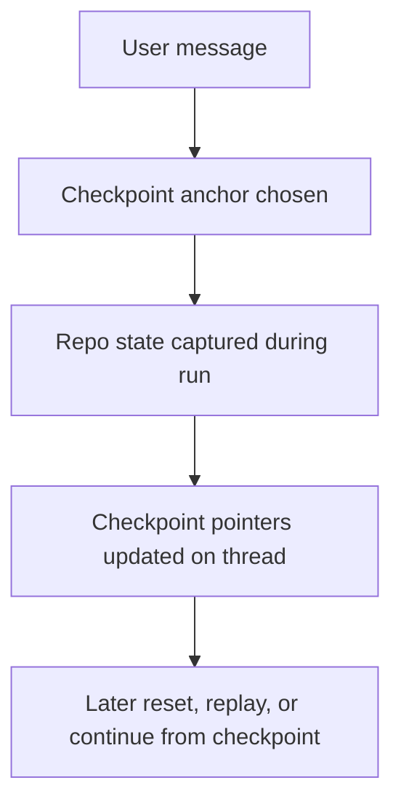

Repo state is part of the thread model in Sentinel.

That changes a lot about how the app behaves.

The thread is carrying more than chat history. It is also carrying the repo position around the task.

That means the repo is part of the conversation state itself.

## What thread repo state can hold

That state can include:

- active branch
- project mode
- worktree path
- linked pull request state
- checkpoint anchor message
- checkpoint cursor
- latest checkpoint pointer

This is the part that makes the repo feel attached to the thread instead of sitting beside it.

Those fields matter because the app is constantly answering small repo questions during a run:

- where is this thread working
- which branch is it tied to
- is it isolated in a worktree
- what checkpoint can it roll back to
- which PR is attached to this line of work

## Project mode

Threads can run against:

- the local project checkout
- a thread worktree

That gives the app two ways to hold the work:

- stay on the main checkout when things are simple
- isolate the thread when the checkout is busy or dirty

## Checkpoint model

Checkpoint state is tied to thread history.

A user message can become the anchor for a checkpoint run. The repo state gets captured there, and later the thread can:

- reset back to that point
- move the cursor
- continue from a later checkpoint path

This is how the app lines up conversation history with code state.

The anchor message matters more than it sounds. It gives the checkpoint a real place in the thread instead of turning it into a detached snapshot with no conversational context.

## Pull request state

The thread can also carry the last PR tied to the work.

That gives the UI enough state to show:

- compare links
- PR metadata
- PR status in the thread view

So branch, checkpoint, worktree, and PR state all end up traveling together.

## Flow

That is the core loop.
