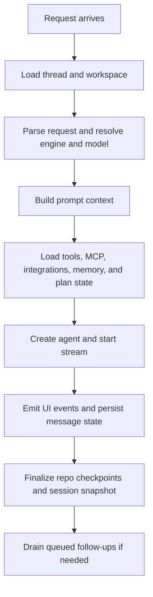

`sentinel` is the built-in harness.

This is the part that turns a thread into a real run instead of a plain prompt call.

It loads the thread, pulls in the workspace state, builds the prompt context, routes tools, handles approvals, streams the run, persists state, and then deals with whatever comes next.

It is also the boundary layer between the app and the underlying model or local runtime.

## What the harness is doing

The model is only one piece in the loop.

The harness is carrying thread state, workspace state, prompt context, plan state, memory retrieval, MCP tools, integrations, repo checkpoint hooks, queued follow-ups, and the live stream state around the run. That is why the app can keep working through a long task without feeling like it resets on every message.

## Code shape

The live run control in the harness is small on purpose. It mostly keeps the abort controller, cancellation flag, and event channel together:

```ts
type ActiveRunControl = {
  abortController: AbortController;
  cancelled: boolean;
  eventChannel: ThreadEventChannel;
};

const activeRunControls = new Map<string, ActiveRunControl>();
```

That small record sits in the middle of stream cancellation, snapshot updates, and run cleanup.

## Run shape

At a high level, the run looks like this:



The important part is that the app is building a lot of runtime state before the model starts answering.

That setup stage is normalizing the request, resolving the current engine and model, loading the thread, loading workspace and repo context, attaching memory, MCP, and integrations, deciding which tool surfaces are available, and preparing the stream and cancellation state.

## Prompt context

The prompt context is assembled from several places.

Usually that means active thread messages, workspace and project context, plan mode state, memory retrieval, enabled integrations, enabled MCP servers, and normalized attachments. That context is what makes the thread feel tied to the project instead of floating on its own.

It also means prompt building is stateful. The app is assembling a real runtime context around the request before the model sees it.

## Tool routing

The harness scopes tools per run.

It routes tools based on the thread, workspace, and active runtime. That matters because the app has several tool surfaces at once, including local tools, repo tools, search, MCP, integrations, sub-agent delegation, and media generation. The routing layer keeps that from turning into one noisy pile.

This matters even more once the thread can delegate child work or trigger media generation, because the runtime has to keep those surfaces scoped and predictable.

## Thread state

The harness manages more than message history.

It also has to keep track of the active stream ID, thread status, queued follow-ups, the session snapshot used by the UI, plan state, repo checkpoint state, and the engine-specific state for Codex, Claude, and Copilot threads. That is where a lot of the product feel comes from.

The thread is really the durable state holder. The run comes and goes. The thread stays.

## Stop, cancel, and follow-ups

Stopping a run is part of the runtime itself.

When a run is stopped, the harness marks the active run as cancelled, aborts the stream, disposes shell session state, resets the thread status, and emits a fresh snapshot. It also has a queue for follow-up work, so a thread can keep the next request lined up while the current run is still busy.

That queue is a small detail, but it changes how the app feels under load. You can treat the thread more like an active workspace and less like a single-turn prompt box.

The queue path is explicit in the runtime. A follow-up gets normalized into a payload and then pushed to the front or tail of the queue:

```ts
const payload = {
  id: request.message.id,
  modelId: request.modelId,
  parts: request.message.parts,
  reasoningEffort: request.reasoningEffort ?? null,
  threadId: request.threadId,
  threadMode,
} as const;

if (position === "front") {
  persist.enqueueThreadFollowUpAtFront(payload);
} else {
  persist.enqueueThreadFollowUp(payload);
}
```

## Repo hooks

The harness also wraps the run with repo checkpoint hooks.

That gives the app a place to start checkpoint capture, update checkpoint pointers, and finalize the checkpoint result when the run finishes. This is how the thread history and repo history stay connected.

## Where `sentinel` sits next to the other engines

`sentinel` is always available because it is the app harness.

`codex`, `claude`, and `copilot` use local runtimes, but Sentinel still keeps the shell and thread model around them.

So there are really two meanings packed into the name:

`sentinel` is the built-in engine choice, and it is also the outer harness that keeps the whole product coherent.

That overlap is deliberate. The same layer that runs the built-in engine is also the layer that keeps Codex, Claude, and Copilot threads attached to the rest of the app.

## Code references

- [`run-thread-chat.ts`](https://github.com/Cronacl/Sentinel/blob/main/src/lib/ai/chat/runtime/run-thread-chat.ts)
- [`session-server.ts`](https://github.com/Cronacl/Sentinel/blob/main/src/lib/ai/chat/session-server.ts)
- [`types.ts`](https://github.com/Cronacl/Sentinel/blob/main/src/lib/ai/chat/engines/types.ts)
