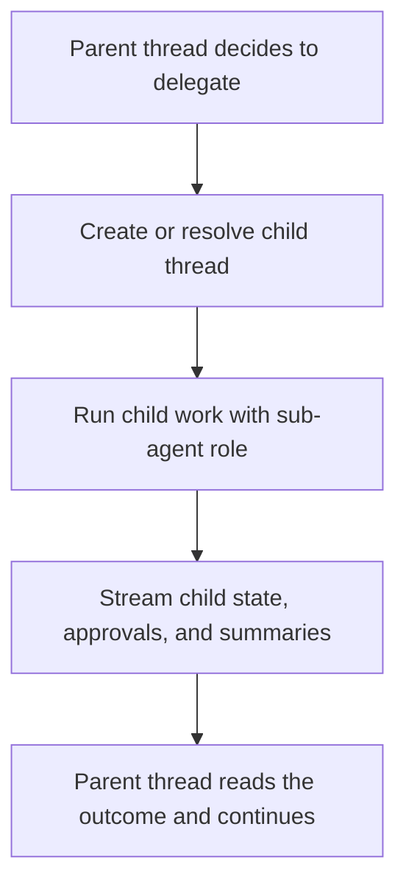

Sub-agents are delegated runs stored through child thread state and thread linkage.

The important part is that delegated work gets its own place to live.

<DocImage
  src="https://storage.googleapis.com/cronacl-public-assets/sentinel/sub-agents.webp"
  alt="Sub-agent threads"
  caption="Delegated work stays visible as its own child surface instead of disappearing into a single parent reply."
/>

## What gets stored

Child work can carry its own:

- run state
- streamed messages
- approvals
- summaries
- errors
- plan questions

That is why the delegated work can stay inspectable.

## Parent and child relationship

The thread model keeps enough linkage to map parent and child work together:

- delegation IDs
- virtual thread links
- source thread links
- agent role

That is how the app can show the child work without flattening it into the parent thread.

The child run is still part of the same broader job, but it has its own state record and its own stream.

## Role in the runtime

The runtime can mark a run as:

- `primary`
- `subagent`

That role changes how the run is handled and how it is surfaced back into the UI.

It also changes what the app expects back from the run. A primary run is driving the main thread forward. A sub-agent run is doing bounded delegated work that feeds back into the parent.

## Flow

The point is simple: child work stays visible.

The other part is that child work stays addressable. The parent thread can point back to a specific delegated run instead of treating it as a generic blob of background activity.

## What this changes

Once a task is large enough to split, the user needs to be able to inspect what happened in the child run.

That is what this model is doing.
