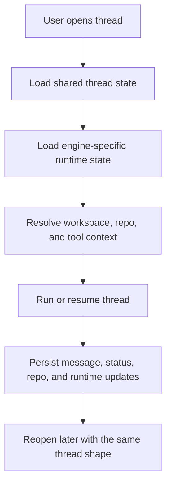

Thread state is the spine of the app.

Every run hangs off it.

That includes the obvious things like messages and mode, but a lot of the product feel comes from the extra state wrapped around the thread.

## What lives on a thread

| State area               | Examples                                                                         |
| ------------------------ | -------------------------------------------------------------------------------- |
| Conversation state       | Message history, thread title, archived state, current mode                      |
| Runtime state            | Engine choice, model choice, active run status, active stream ID                 |
| Workspace state          | Workspace link, working directory, project root                                  |
| Queue and approval state | Queued follow-ups, pending approvals, status transitions                         |
| Repo state               | Active branch, project mode, worktree path, checkpoint pointers, linked PR state |
| Engine-specific state    | Codex thread ID and sandbox policy, Claude session ID and permission mode, Copilot session ID and reasoning effort |

That is why reopening a thread can feel like resuming work instead of opening a saved transcript.

## Shared state and engine state

Some thread state is shared across every engine.

That shared layer covers the title, archived state, workspace link, messages, plan state, repo state, follow-up queue, and run status. Then each engine adds its own runtime layer on top.

| Layer               | What it carries                                                                              |
| ------------------- | -------------------------------------------------------------------------------------------- |
| Shared thread state | Title, workspace link, messages, mode, repo state, queue, run status                         |
| Codex-only state    | Codex thread ID, approval policy, sandbox mode, reasoning effort, runtime model, CLI version |
| Claude-only state   | Claude session ID, permission mode, runtime model, working directory                         |
| Copilot-only state  | Copilot session ID, reasoning effort, runtime model, working directory                       |

So the thread is carrying both the shared product state and the engine-specific session state.

## Why the thread sits in the middle

If that state lived only inside the local runtimes, the app would lose a lot every time a session paused or the UI refreshed.

If it lived only in the UI, the runtimes would feel thin and disconnected.

The thread sits in the middle and keeps both sides lined up.

## State flow



## Mutable parts during a run

Some thread fields move a lot during an active run.

The ones that matter most are run status, active stream state, approvals, queued follow-ups, repo checkpoint pointers, and engine runtime session state. Those fields change while output is streaming, while tools are running, and while the run is being stopped or resumed.

## What stays stable

Other parts are more stable:

The workspace link, thread identity, base mode, and most of the historical messages tend to stay put. That split is useful. It means the app can update the live parts of a thread without treating the whole record like one giant mutable blob.

## Where this shows up in the product

You can feel thread state in a few places:

You can feel it when an old run opens with the right engine setup still attached, when a thread stays on the same branch or worktree, when pending approvals survive the stream, when a plan thread still has its task state, and when a delegated child run opens with its own status instead of flattened text. Most of the product behavior in Sentinel comes back to this.

## Code references

The durable thread fields are visible in the schema:

```ts
activeStreamId: text("active_stream_id"),
contextCompactionSummary: text("context_compaction_summary"),
contextCompactionCoveredThroughMessageId: text(
  "context_compaction_covered_through_message_id",
),
contextCompactionUpdatedAt: integer("context_compaction_updated_at", {
  mode: "timestamp",
}),
```

- [`schema.ts`](https://github.com/Cronacl/Sentinel/blob/main/src/server/db/schema.ts)
- [`types.ts`](https://github.com/Cronacl/Sentinel/blob/main/src/lib/ai/chat/engines/types.ts)
